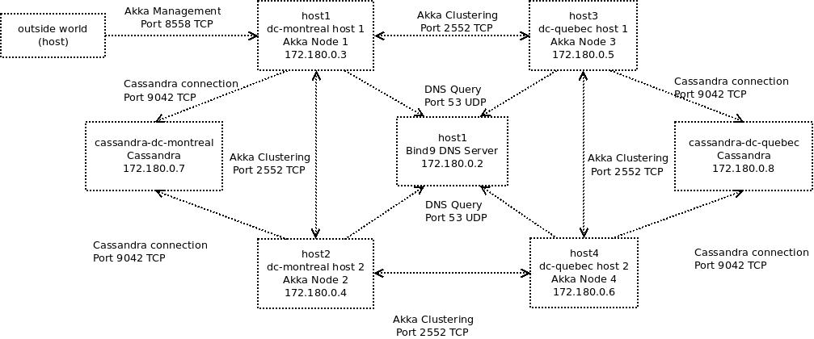
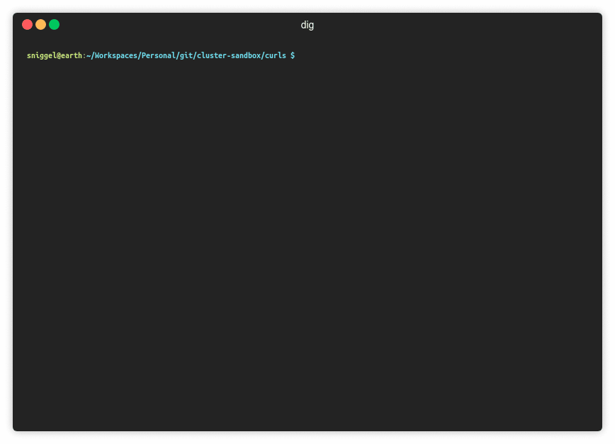

# Cluster Sandbox

This is a small proof of concept using Akka Clustering and Docker.

## TLDR

Using Akka Clustering with ClusterBoostrap and AkkaManagement, it is possible to create an Akka cluster by using DNS records.
Once a node is started, it will query the DNS server for A and SRV records for a given cluster name and service namespace.

## Project Architecture

This project is running 3 dockers containers, 2 Akka nodes forming a cluster and 1 DNS server running Bind9.

Part of the cluster, namely the Entity is using Akka-Typed which at the time this page was written, was a work in progress at Lightbend. Akka-Typed is the next version of Akka using Typed actors.

## Usage

Simply invoke `docker-compose -f docker-compose.yml up` to start the cluster and wait for the cluster to come up:

Once the cluster is running we can check that the members have succesfully joined togheter (httpie command output):

We can also check the output of `dig` to check the dns zones and records:

## How it works

When a node is started, it asks the DNS for A and SRV records and then try to establish a connection to all the cluster nodes with a gossip protocol. A leader is then elected and then the shards are automaticatlly distributed over the nodes.

## Notes

To push to docker hub, you must login with the docker CLI first.